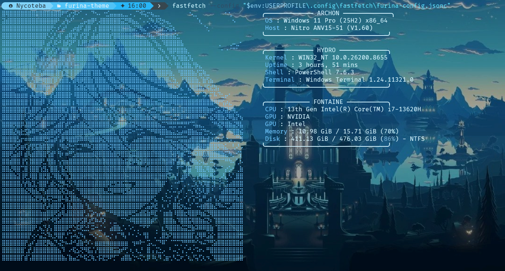
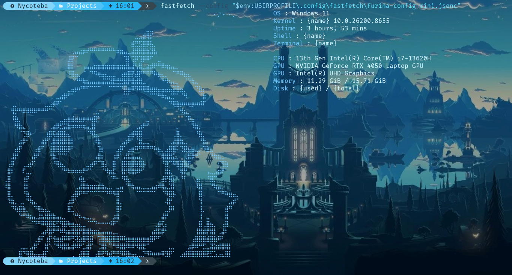

# 𝓕𝓾𝓻𝓲𝓷𝓪 𝓣𝓱𝓮𝓶𝓮

[](https://github.com/PowerShell/PowerShell)
[](https://ohmyposh.dev/)
[](https://github.com/fastfetch-cli/fastfetch)
[](LICENSE)
[](https://www.microsoft.com/windows)
[](https://genshin-impact.fandom.com/wiki/Furina)

> *"A Hydro Archon of Fontaine, bringing elegance to your terminal."*

E aí! Depois de criar o Ghoul Theme, quis fazer algo completamente diferente — algo que trouxesse a elegância e a leveza da **Furina** de Genshin Impact. E foi assim que nasceu o **Furina Theme**.

Feito com **Oh My Posh** rodando no **PowerShell 7.6.3**, esse tema é uma mistura de:
-  Estética suave e profissional com tons de azul
-  Inspiração na Hydro Archon de Fontaine
-  Paleta "Fantasy Blue" personalizada
-  Detalhes que trazem a vibe do universo de Genshin

Queria algo que fosse mais "pessoal" sabe? Profissional, claro, mas com aquela vibe única de quem fez com carinho. E é isso que você vai ver aqui.

##  Preview





##  Componentes

- **Oh My Posh** - Prompt personalizado com paleta suave
- **FastFetch** - Info do sistema com tema Hydro/Fontaine
- **Nerd Fonts** - JetBrainsMono Nerd Font + FiraCode Nerd Font Mono
- **Windows Terminal** - Background personalizado com esquema Fantasy Blue

## 📦 Instalação

### Pré-requisitos

- [PowerShell 7+](https://github.com/PowerShell/PowerShell)
- [Oh My Posh](https://ohmyposh.dev/)
- [FastFetch](https://github.com/fastfetch-cli/fastfetch)
- [JetBrainsMono Nerd Font](https://www.nerdfonts.com/)
- [FiraCode Nerd Font](https://www.nerdfonts.com/)
- [Git](https://git-scm.com/)

### 1. Clonar o repositório

```bash
git clone https://github.com/Nyc0lasR4mos/furina-theme.git
cd furina-theme
```
### 2. Instalar o tema Oh My Posh

Copie o arquivo powershell/FurinaTheme.omp.json para:

C:\Users\SEU-USUARIO\PowerShell\FurinaTheme.omp.json

### 3. Configurar o PowerShell Profile

Copie powershell/Microsoft.PowerShell_profile.ps1 para:

C:\Users\SEU-USUARIO\Documents\PowerShell\Microsoft.PowerShell_profile.ps1

### 4. Configurar o FastFetch

Copie os arquivos da pasta fastfetch/ para:

C:\Users\SEU-USUARIO\.config\fastfetch\

### 5. Configurar o Windows Terminal

Abra o windows-terminal/settings.json e adicione o esquema de cores Fantasy Blue na seção "schemes":

{
  "name": "Fantasy Blue",
  "background": "#0A1523",
  "foreground": "#D4F4FF",
  "cursorColor": "#FFFFFF",
  "selectionBackground": "#2E5575",
  "black": "#0A1523",
  "red": "#4A7DA2",
  "green": "#67B8D9",
  "yellow": "#A4E7FF",
  "blue": "#3F83B8",
  "purple": "#6AB8FF",
  "cyan": "#5FE4FF",
  "white": "#D4F4FF",
  "brightBlack": "#304A63",
  "brightRed": "#6FA9CF",
  "brightGreen": "#8FD5F5",
  "brightYellow": "#C9F5FF",
  "brightBlue": "#6FC7FF",
  "brightPurple": "#98D8FF",
  "brightCyan": "#B5F5FF",
  "brightWhite": "#FFFFFF"
}

Depois, no perfil do PowerShell, adicione:

"colorScheme": "Fantasy Blue"

### 6 Recarregar

& $PROFILE

### Funcionalidades
 Prompt com separadores powerline suaves
 Paleta de cores "Fantasy Blue" personalizada
 FastFetch com tema Hydro e Fontaine
 ASCII art personalizado da Furina (versão completa e mini)
 Ícones personalizados das Nerd Fonts
 Versão completa e minimalista do FastFetch
 Cores suaves e harmoniosas

 ### Paleta de Cores (Fantasy Blue)

 ### Esquema de Cores (Windows Terminal)

### Licença

MIT License - Sinta-se livre para usar e modificar!

### Créditos

ASCII art da Furina baseado em arte da comunidade
Tema inspirado na Furina de Genshin Impact (miHoYo/HoYoverse)
Paleta "Fantasy Blue" personalizada
Conceito Hydro/Fontaine do universo de Teyvat

### Nycolas Ramos

[](https://www.linkedin.com/in/nycolas-ramos-483810399/) [](https://github.com/Nyc0lasR4mos)
